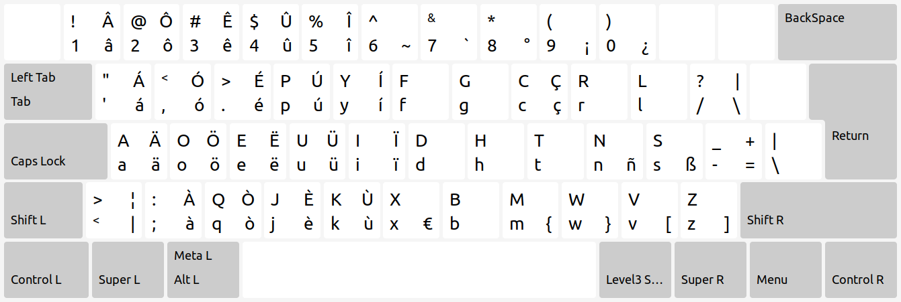
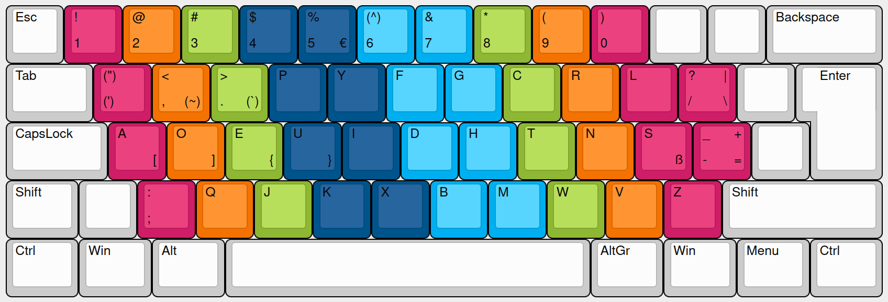

# Dvorax

Dvorak keyboard layout with international characters.

## xkb/Linux



Two layouts are available:
- One for usage with an ISO layout, e.g. a laptop keyboard.
- One for usage with a QMK-configured programmable keyboard already set up to Dvorax. This additional software layout adds special characters without changing anything else to the hardware layout.

### Usage

1. Copy [dx](xkb/dx) into `/usr/share/X11/xkb/symbols`.
2. Add `dx Dvorax` to the layout list in `/usr/share/X11/xkb/rules/evdev.lst` (file section that starts with `! layout`).
3. Add the following layout to `/usr/share/X11/xkb/rules/evdev.xml` (file section that starts with `<layoutList>`):
```
<layout>
  <configItem>
    <name>dx</name>
    <shortDescription>dx</shortDescription>
    <description>Dvorax</description>
  </configItem>
  <variantList>
   <variant>
     <configItem>
      <name>qmk</name>
        <description>Dvorax (QMK)</description>
     </configItem>
   </variant>
  </variantList>
</layout>
```
4. Log out and log back in. The layout should be available in the system preferences like any other language.

## Keyboard Layout Creator/Windows



### Usage
Open with Microsoft Keyboard Layout Creator, generate the installer, and install. The layout should appear as "German - Custom" or something similar.

